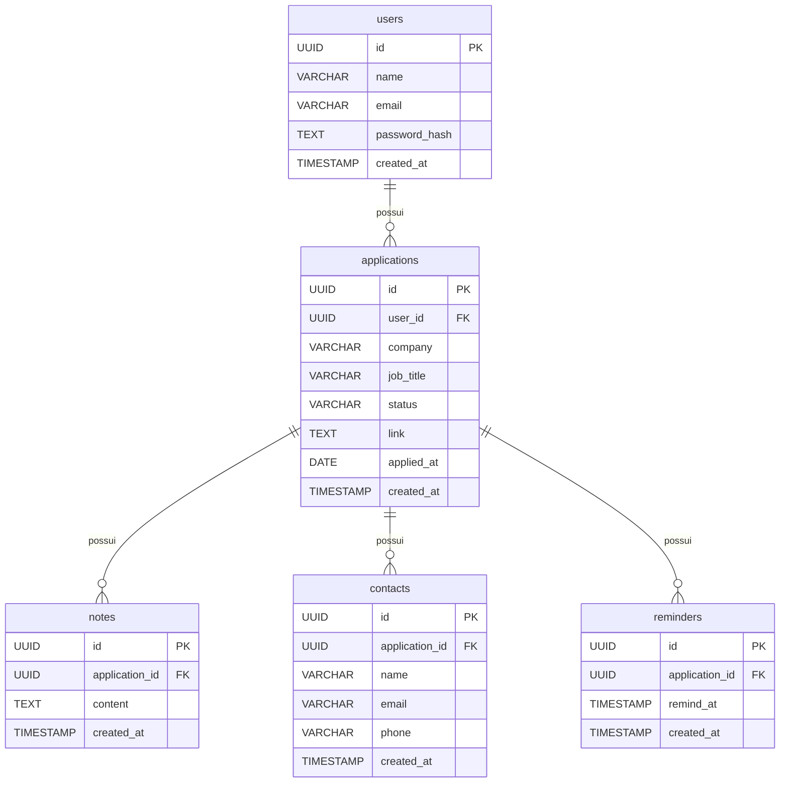

```mermaid
erDiagram

    users {
        UUID id PK
        VARCHAR name
        VARCHAR email
        TEXT password_hash
        TIMESTAMP created_at
    }

    applications {
        UUID id PK
        UUID user_id FK
        VARCHAR company
        VARCHAR job_title
        VARCHAR status
        TEXT link
        DATE applied_at
        TIMESTAMP created_at
    }

    notes {
        UUID id PK
        UUID application_id FK
        TEXT content
        TIMESTAMP created_at
    }

    contacts {
        UUID id PK
        UUID application_id FK
        VARCHAR name
        VARCHAR email
        VARCHAR phone
        TIMESTAMP created_at
    }

    reminders {
        UUID id PK
        UUID application_id FK
        TIMESTAMP remind_at
        TIMESTAMP created_at
    }

    users ||--o{ applications : "possui"
    applications ||--o{ notes : "possui"
    applications ||--o{ contacts : "possui"
    applications ||--o{ reminders : "possui"
```
